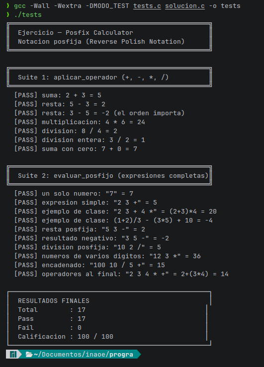

# Posfix Calculator

## Descripción

Implementación de una calculadora de notación posfija (**Postfix / Reverse Polish Notation**) en lenguaje C.

La solución implementa las funciones requeridas:

```c
int aplicar_operador(int a, int b, char op);
int evaluar_posfijo(const char *expresion);
```

La evaluación de expresiones se realiza mediante una **pila (stack)**, siguiendo las restricciones establecidas en la actividad.

---

## Archivos

### `solucion.c`

Contiene la implementación de:

- `aplicar_operador()`
- `evaluar_posfijo()`

### `tests.c`

Archivo proporcionado por el profesor para la evaluación automática.



Captura de la ejecución de la suite de pruebas donde se muestra la cantidad de pruebas aprobadas.

---

## Compilación

Compilar utilizando:

```bash
gcc -Wall -Wextra -DMODO_TEST tests.c solucion.c -o tests
```

---

## Ejecución

```bash
./tests
```

---

## Ejemplos

### Expresión

```text
2 3 + 4 *
```

Equivalente a:

```text
(2 + 3) * 4
```

Resultado:

```text
20
```

---

### Expresión

```text
1 2 + 3 / 3 5 * - 10 +
```

Equivalente a:

```text
(1 + 2) / 3 - (3 * 5) + 10
```

Resultado:

```text
-4
```

---

## Autor

**Victor Axel Rodriguez Ocampo**